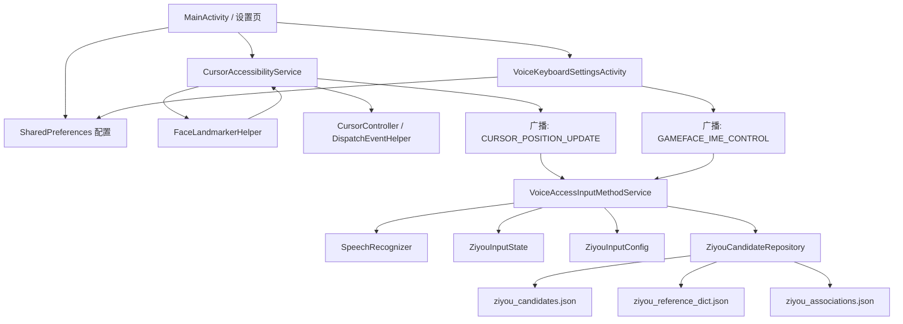

# AICC_ZHOU_Android

Android 版 AICC_ZHOU 项目，基于 Project Gameface 扩展出面向中文输入场景的自由键盘能力。当前仓库同时包含：

- 基于人脸关键点和表情系数的无障碍光标控制
- 通过广播驱动的语音输入法控制链路
- 自由拼音输入模式、候选词和联想词能力
- 可停靠、可自由悬浮、可跟随指针的输入法交互模式

## 仓库结构

- Android/
	Android Studio / Gradle 工程根目录
- Android/app/src/main/java/com/google/projectgameface/
	核心 Java 代码，包括无障碍服务、相机推理、输入法和设置页
- Android/app/src/main/res/
	UI 布局、字符串、Drawable 和输入法资源描述
- Android/app/src/main/assets/
	自由拼音候选词、参考词典裁剪结果、联想词数据
- Android/tools/generate_ziyou_assets.js
	从参考仓库词典生成 Android 可用裁剪资产的脚本
- docs/architecture.md
	详细架构说明

## 架构概览

项目可以分成 5 层：

1. 主应用层
	 负责设置入口、权限引导、功能开关和配置页面。
2. 无障碍服务层
	 负责创建虚拟光标、执行点击/拖拽/系统操作，并对外广播当前光标位置。
3. 视觉推理层
	 负责相机采集、MediaPipe 人脸关键点检测、表情系数解析。
4. 输入法层
	 负责语音识别、键盘 UI、自由拼音状态机、候选词和联想词展示。
5. 数据与配置层
	 负责 SharedPreferences、拼音静态映射、候选词资产和联想词资产。



## 关键模块

### 1. 主应用与设置入口

- MainActivity
	统一入口页，负责：
	- 引导相机和无障碍权限
	- 打开光标速度设置、手势绑定、输入法设置页
	- 首次启动时写入默认表情绑定
- VoiceKeyboardSettingsActivity
	输入法设置页，负责：
	- 切换停靠 / 自由悬浮 / 跟随指针模式
	- 切换 100 / 120 / 140 三档缩放
	- 切换跟随策略和主题
	- 广播通知输入法刷新配置

### 2. 无障碍光标链路

- CursorAccessibilityService
	整个系统的运行时核心，负责：
	- 启动 CameraX 和视觉推理线程
	- 根据人脸关键点结果驱动光标移动
	- 把面部表情映射为点击、长按、回首页、切换输入法模式等动作
	- 定时广播光标位置给输入法
- CursorController
	封装光标位置、移动速度和平滑配置。
- DispatchEventHelper
	把高层动作转换为 Accessibility 事件。

### 3. 视觉推理链路

- FaceLandmarkerHelper
	基于 MediaPipe Face Landmarker 运行实时人脸检测，输出：
	- 头部位置
	- 表情 blendshape 系数
	- 人脸可见性状态
- CameraHelper / CameraBoxOverlay / FullScreenCanvas / ServiceUiManager
	负责相机预览、浮层和服务 UI 展示。

### 4. 输入法链路

- VoiceAccessInputMethodService
	自定义 InputMethodService，负责：
	- 语音识别预览和文本提交
	- 键盘行动态构建
	- 自由拼音模式切换
	- 候选词条和联想词展示
	- 自由悬浮、跟随指针、面板拖拽、缩放和主题应用
- VoiceKeyboardConfig
	输入法配置中心，统一管理：
	- 交互模式
	- 缩放档位
	- 跟随策略
	- 主题
	- 面板归一化位置

### 5. 自由拼音链路

- ZiyouInputConfig
	定义自由拼音键盘布局，以及声母到韵母集合的静态映射。
- ZiyouInputState
	管理自由拼音输入过程中的状态：
	- 待补全声母
	- 拼音组合预览
	- 删除最后一个音节
- ZiyouCandidateRepository
	聚合三类数据源：
	- 小型平面候选词表
	- 裁剪后的参考全拼词典
	- 裁剪后的联想词表

## 运行时数据流

### 光标与输入法联动

1. MainActivity 启动无障碍服务。
2. CursorAccessibilityService 调用 FaceLandmarkerHelper 持续处理相机帧。
3. 光标位置变化后，服务广播 CURSOR_POSITION_UPDATE。
4. VoiceAccessInputMethodService 接收坐标广播。
5. 输入法根据当前模式：
	 - 停靠模式：保持固定位置
	 - 自由悬浮模式：允许拖拽和吸附到指针附近
	 - 跟随指针模式：按策略重算面板位置

### 自由拼音候选流程

1. 用户切换到自由拼音模式。
2. 点击声母后拉起韵母面板。
3. 选中韵母后，ZiyouInputState 更新拼音组合预览。
4. VoiceAccessInputMethodService 调用 ZiyouCandidateRepository 查询候选词。
5. 用户点击候选词后提交文本。
6. 输入法继续基于已提交词条查询联想词并展示下一条候选。

### 资产生成流程

1. 参考仓库中的 dict.json 和 association.json 作为原始词典来源。
2. Android/tools/generate_ziyou_assets.js 对数据做裁剪和去重。
3. 输出为 Android/app/src/main/assets 下的 JSON 文件。
4. ZiyouCandidateRepository 在运行时读取这些资产。

## 当前实现状态

- 已完成
	- 自由键盘基础 UI
	- 停靠 / 自由悬浮 / 跟随指针三种交互模式
	- 100 / 120 / 140 三档缩放
	- 中文界面文案
	- 自由拼音候选词与联想词能力
	- 面部手势对输入法命令的广播控制
- 已做 Android 化简
	- 参考词典使用裁剪版，而不是直接加载全量大词库
	- 键盘交互以 Android IME 窗口约束为前提，不追求桌面/Web 端逐像素复刻

## 构建

已验证可用的本地构建方式：

```powershell
$env:JAVA_HOME='C:\Users\admin\.jdks\jbr-17.0.14'
Set-Location 'd:\Songchen\AICC_ZHOU_Android\Android'
.\gradlew.bat assembleDebug
```

要求：

- JDK 17
- Android Studio 或已配置的 Android SDK

## 详细架构说明

详细设计请看 [docs/architecture.md](docs/architecture.md)。